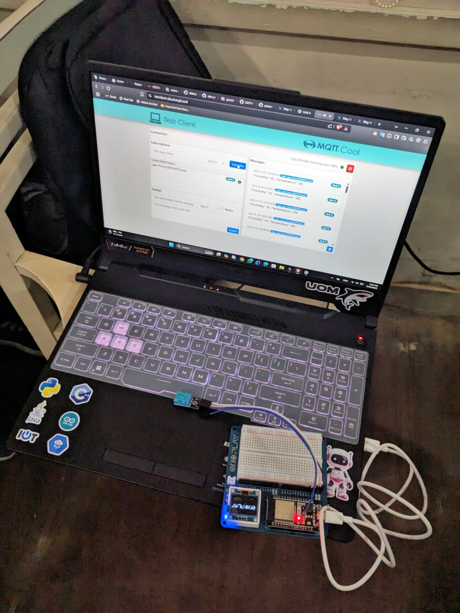

# 🌤️ ESP32 Smart Weather Station

A real-time IoT weather monitor built using MicroPython. This project reads environmental data from a physical sensor and hosts a live web dashboard accessible from any device on the local network. 

### ✨ Project Overview
This project was developed during the **"Ignite 24" IoT Workshop**, a two-day hands-on hardware and software session organized by the IEEE Student Branch of the University of Kelaniya.

**Core Capabilities:**
* 🔌 **Hardware Interfacing:** Reads real-time data from a DHT11 Temperature and Humidity sensor using an ESP32 microcontroller.
* 🌐 **Local Web Server:** The ESP32 acts as an independent web server, connecting to the local Wi-Fi network to broadcast the sensor data.
* 🖥️ **Live Dashboard:** Displays a clean HTML webpage showing the current temperature and humidity, updating dynamically.

### 🛠️ Hardware & Software Stack
* **Microcontroller:** NodeMCU ESP32
* **Sensor:** DHT11 
* **Language:** MicroPython
* **IDE:** Thonny

### 🗂️ Repository Contents
* `main.py`: The core MicroPython script containing the sensor reading logic, Wi-Fi connection setup, and HTML web server formatting.
* `CP210x...` files: The Silicon Labs USB-to-UART bridge drivers required for Windows machines to recognize the ESP32 via USB.

### 🚀 How to Use
1. **Install Drivers:** If your computer does not recognize the ESP32, run the included `CP210xVCPInstaller_x64.exe` to install the necessary USB drivers.
2. **Flash MicroPython:** Ensure your ESP32 is flashed with the latest MicroPython firmware.
3. **Upload Code:** Open `main.py` in Thonny, update the Wi-Fi credentials (`SSID` and `Password`) to match your local network, and save it directly to the ESP32.
4. **View Data:** Reboot the board. Open the Thonny shell to find the assigned IP address, then type that IP address into your web browser to view the live weather dashboard.

