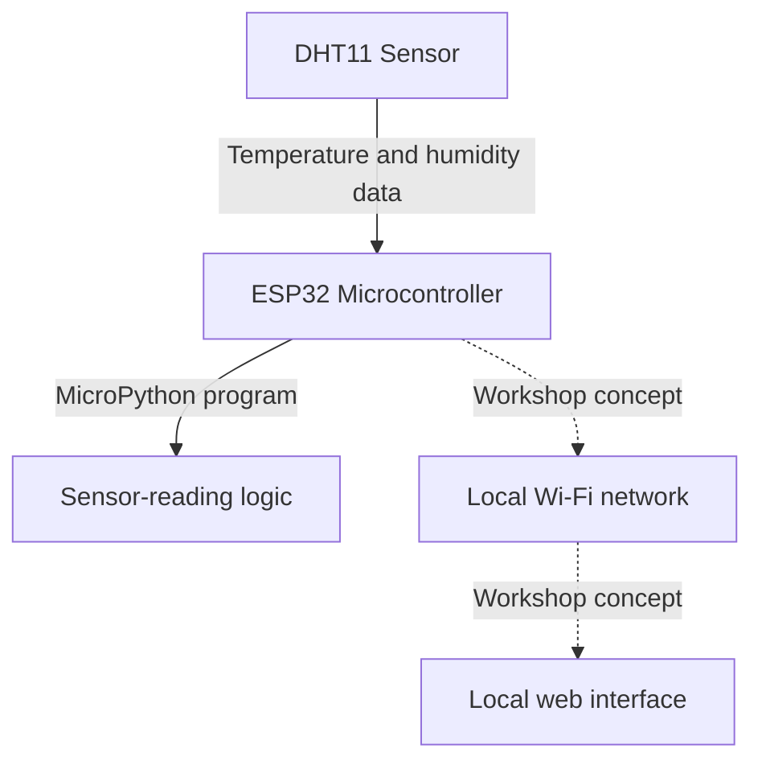
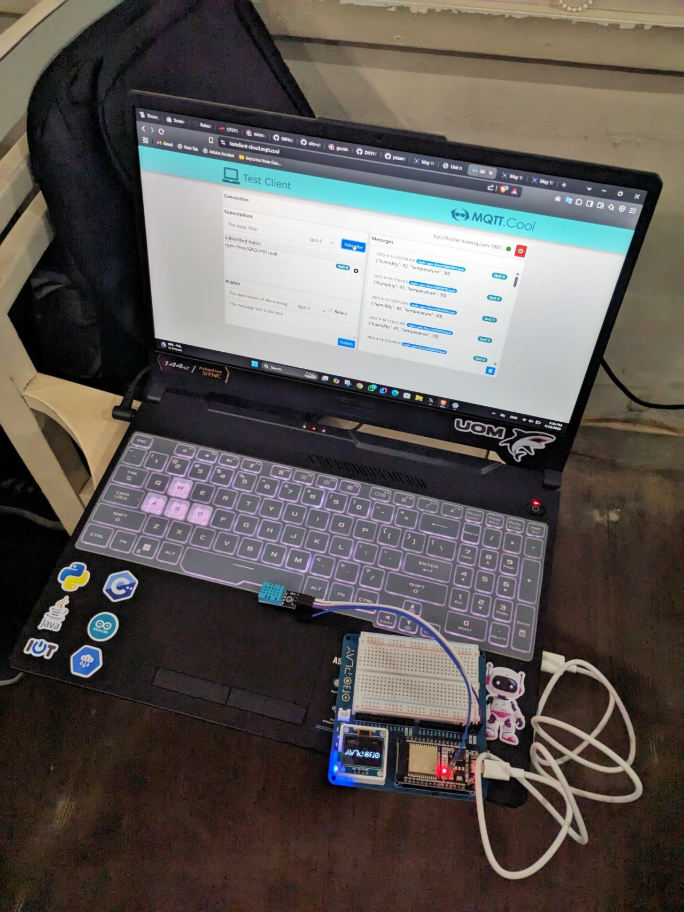

# 🌦️ ESP32 Smart Weather Station

A hands-on IoT workshop project exploring how an ESP32 microcontroller can work with a DHT11 temperature and humidity sensor using MicroPython. The repository documents the workshop context, development setup, sensor-reading code, and the intended connection between physical sensor data, Wi-Fi, and a local web interface.

> This repository represents a practical learning experience from an IoT workshop. It should be read as both a project record and a technical reference for experimenting with ESP32 hardware and MicroPython.


## 📌 About the Project

The **ESP32 Smart Weather Station** is a small-scale IoT learning project based on the following idea:

1. A **DHT11 sensor** provides temperature and humidity readings.
2. An **ESP32** acts as the microcontroller that interfaces with the sensor.
3. **MicroPython** is used to write and run the hardware-control logic.
4. The ESP32 can be connected to a local Wi-Fi network.
5. The workshop concept included making the readings available through a local web interface.

The project demonstrates the connection between physical hardware and software: a sensor produces environmental data, a microcontroller processes it, and network connectivity can make that data accessible to another device.

### Current implementation status

The repository contains an instructional `main.py` file that currently demonstrates the basic structure for repeatedly reading a DHT-family sensor and handling sensor-read errors. The file defines a DHT data pin, includes the `dht` module, and uses a loop with `OSError` handling.

The repository documentation describes a broader workshop concept involving Wi-Fi and a local weather dashboard. However, the current checked-in `main.py` does **not** include a complete web-server implementation, Wi-Fi connection code, sensor initialization, or completed temperature/humidity output logic. These should therefore be treated as workshop objectives or documented concepts rather than fully implemented features in the current source file.

## 🎓 Workshop Context

This repository documents work associated with **Ignite ’24 — IoT Workshop**, described in the existing project documentation as a two-day, hands-on hardware and software workshop organized by the **IEEE Student Branch of the University of Kelaniya**.

The repository was created to preserve the technical work and learning resources connected with that experience, including:

- The MicroPython source file used for sensor experimentation
- Setup documentation for ESP32 development
- Thonny-related resources
- CP210x USB-to-UART driver support files
- A workshop image

The repository does not establish that the author was an organizer, instructor, mentor, speaker, or project leader. It represents participation and documentation of a practical learning activity.

## 🎯 Learning Objectives

The project and its workshop context support the following learning objectives:

- Understand the role of an ESP32 in a small IoT system
- Interface a microcontroller with a DHT11 sensor
- Explore MicroPython for embedded programming
- Identify the GPIO pin used for sensor data
- Read environmental sensor data in a repeated loop
- Handle possible sensor communication errors
- Understand how Wi-Fi can connect an IoT device to a local network
- Explore the architecture of a local sensor-data web interface
- Connect hardware concepts with software implementation
- Become familiar with Thonny as a MicroPython development tool
- Troubleshoot basic ESP32 USB and serial-communication setup

## 🧩 System Overview

The following diagram represents the intended workshop architecture and the relationship between the project components:


```mermaid
flowchart TD
    A[DHT11 Sensor] -->|Temperature and humidity data| B[ESP32 Microcontroller]
    B -->|MicroPython program| C[Sensor-reading logic]
    B -.->|Workshop concept| D[Local Wi-Fi network]
    D -.->|Workshop concept| E[Local web interface]
```

### Component roles

| Component | Role in the project |
|---|---|
| **DHT11** | Provides temperature and humidity measurements. |
| **ESP32 / NodeMCU ESP32** | Interfaces with the sensor and runs the MicroPython program. |
| **MicroPython** | Provides the programming environment for working with the ESP32. |
| **GPIO pin** | Carries the sensor data signal to the ESP32. The current `main.py` sets `DHT_PIN = 2`. |
| **Wi-Fi** | Represents the intended network connection for accessing sensor data locally. |
| **Local web interface** | Described in the repository documentation as the intended way to view readings; it is not implemented in the current `main.py`. |
| **Thonny** | Used as the development and device-programming environment. |

## 🛠️ Technologies & Components

| Technology / Component | Purpose |
|---|---|
| Python / MicroPython | Programming language and embedded runtime |
| NodeMCU ESP32 | Microcontroller platform |
| DHT11 | Temperature and humidity sensor |
| Wi-Fi | Local network connectivity concept |
| Thonny | MicroPython development environment |
| CP210x driver | USB-to-UART communication support for compatible ESP32 boards |

## 📁 Project Structure

```text
.
├── README.md                 # Project overview, workshop context, and usage notes
├── main.py                   # Instructional MicroPython sensor-reading script
├── workshop.jpg              # Workshop setup image
├── Thonny guide.png          # Thonny setup/reference image
├── thonny-4.1.7.exe         # Thonny installer included as a setup resource
└── CP210x_VCP_Windows.zip    # CP210x Windows driver package
```

> The repository also includes binary setup resources. These files are retained as workshop support materials rather than application dependencies.

## 💻 Source Code Overview

The main source file is [`main.py`](./main.py).

Its current structure includes:

- Importing `Pin` from `machine`
- Importing `sleep` from `time`
- Importing the MicroPython `dht` module
- Defining the sensor data pin with `DHT_PIN = 2`
- Repeating the sensor-reading workflow inside an infinite loop
- Waiting between readings with `sleep(2)`
- Catching `OSError` when a sensor read fails

```python
from machine import Pin
from time import sleep
import dht

DHT_PIN = 2

while True:
    try:
        sleep(2)
        # Sensor measurement and output logic can be added here.
    except OSError as error:
        print("Failed to read sensor.")
```

The comments in `main.py` indicate where sensor setup, measurement, and output logic were intended to be added. The current file should therefore be treated as a workshop-oriented template or partial implementation.

## 🚀 Workshop Setup Reference

The existing project documentation describes the following general setup workflow for experimenting with the hardware:

1. Install the appropriate CP210x USB-to-UART driver if the ESP32 is not detected.
2. Install or use Thonny for MicroPython development.
3. Flash the ESP32 with MicroPython firmware.
4. Connect the DHT11 data line to the GPIO pin expected by the program.
5. Upload the MicroPython file to the ESP32.
6. Continue the sensor-reading implementation and test the hardware connection.
7. If a web-server version is developed, connect the ESP32 to a local Wi-Fi network and access the interface from a device on the same network.

### Important setup note

The repository includes setup resources and documentation for the broader workshop workflow. The current `main.py` does not yet contain all of the code required to complete the Wi-Fi and local web-server stages.

## 🖼️ Workshop Documentation

The repository includes an image from the workshop setup:



A Thonny setup reference is also available in [`Thonny guide.png`](./Thonny%20guide.png).

## ✅ What This Repository Demonstrates

- Practical exposure to ESP32-based IoT development
- Basic interaction between a microcontroller and a DHT11 sensor
- Use of MicroPython in an embedded context
- A repeated sensor-reading control flow
- Basic error handling for sensor communication
- The intended relationship between sensor data, Wi-Fi, and a local interface
- Documentation of a hands-on technical learning experience

## ⚠️ Limitations and Scope

This repository should not currently be interpreted as a production-ready weather-monitoring system.

The current source does not provide:

- A complete DHT11 sensor initialization and measurement sequence
- A completed temperature and humidity display
- A Wi-Fi connection routine
- A complete HTTP server
- A finished HTML dashboard
- Persistent data storage
- Remote access outside the local network
- Automated tests or deployment configuration

These limitations reflect the current state of the checked-in workshop source and help distinguish the project concept from the implementation that is presently available in the repository.

## 🔭 Possible Next Steps

If the project is continued, suitable next steps could include:

- Initialize the DHT11 sensor object using the configured GPIO pin
- Add temperature and humidity measurement calls
- Print validated readings to the serial console
- Add Wi-Fi connection handling without exposing credentials
- Implement a small HTTP server on the ESP32
- Serve a simple HTML page containing the latest sensor values
- Add clearer setup instructions for different ESP32 board variants
- Replace bundled installers with links to official vendor pages where appropriate

These are potential improvements, not features currently claimed as complete.

## 📚 References Within This Repository

- [`main.py`](./main.py) — MicroPython sensor-reading template
- [`workshop.jpg`](./workshop.jpg) — Workshop setup image
- [`Thonny guide.png`](./Thonny%20guide.png) — Thonny reference material
- [`CP210x_VCP_Windows.zip`](./CP210x_VCP_Windows.zip) — Windows driver package included in the repository

## 👤 Portfolio Note

This project represents a practical step in learning how software interacts with physical hardware. It records an experience with ESP32 development, sensor interfacing, MicroPython, and the foundations of IoT system design.
